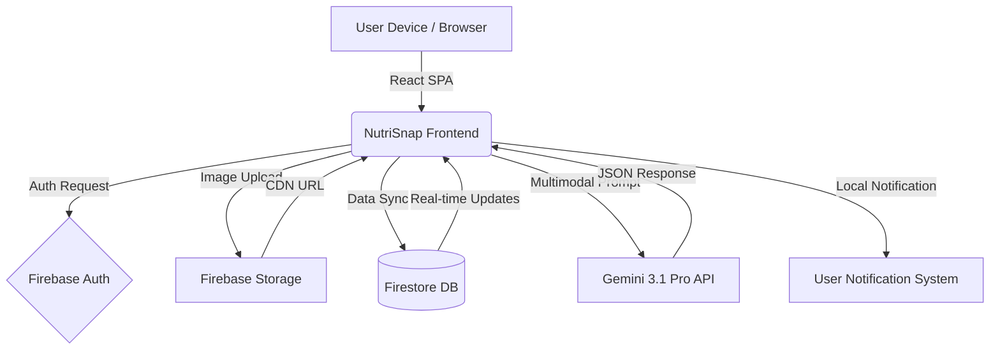

# NutriSnap AI - Intelligent Nutrition & Fitness Companion

NutriSnap is a production-grade health and fitness application designed to simplify the complex process of nutrition tracking. By leveraging cutting-edge Artificial Intelligence and a seamless mobile-first user experience, NutriSnap transforms a simple photo into a detailed nutritional breakdown and personalized coaching session.

## 🏗 System Architecture

The application follows a modern, serverless full-stack architecture optimized for low latency and high scalability.

- **Frontend**: React 18 Single Page Application (SPA) built with Vite and TypeScript.
- **Styling**: Tailwind CSS 4.0 for utility-first design, following a premium iOS aesthetic with glassmorphism and fluid animations.
- **State Management**: React Context API (`UserContext`) for global state, including user profile, real-time scan history, and daily nutritional summaries.
- **Backend-as-a-Service**: Firebase (Firestore for real-time data, Auth for secure identity, Storage for high-res images).
- **AI Engine**: Google Gemini 3.1 Pro and Flash models for multimodal image analysis and conversational coaching.
- **Haptics & Notifications**: Custom integration for tactile feedback and local reminders.

## 📊 Block Diagram



## 🧩 Problem & Solution

**The Problem**: Traditional calorie counting is tedious. Users must manually search for ingredients, estimate portions, and log data into complex spreadsheets. This friction leads to low adherence and abandoned health goals. Most apps lack personalized context, treating every user with generic advice.

**The Solution**: NutriSnap removes the friction through AI-first design.
1. **Instant Analysis**: A single photo identifies food, estimates portions, and calculates macros using Gemini's advanced vision capabilities.
2. **Body Metrics**: AI-driven body type and fat percentage estimation from images, providing a more holistic view of health than just weight.
3. **Conversational Coaching**: A personalized AI coach that understands your specific goals, history, and current progress, offering actionable insights rather than just data.
4. **Frictionless Logging**: Multiple entry points (Scan, Search, Manual) ensure that logging a meal never takes more than a few seconds.

## 🔄 Detailed Workflow

1. **Onboarding & Profile Setup**: Users set their physical metrics (height, weight) and fitness goals (lose, gain, maintain). The app automatically calculates base calorie limits and macro targets based on these inputs.
2. **Meal Logging**:
   - **Scan**: User captures or uploads a food image. Gemini 3.1 Pro analyzes the image, returning a structured JSON with food name, calories, protein, carbs, and fats.
   - **Search**: Users can search a predefined database for common foods.
   - **Manual**: Direct input for homemade meals or specific nutritional labels.
3. **Data Persistence**: All logs are automatically synced to Firestore and aggregated into daily nutritional summaries.
4. **AI Coaching**: The AI Coach analyzes the user's profile and recent scans. It provides context-aware advice, identifies trends, and suggests follow-up questions to help users understand their habits.
5. **Real-time Monitoring**: The Home screen visualizes progress against daily calorie and water goals using fluid animations and color-coded indicators.
6. **Settings & Customization**: Users can refine their macro percentages, set water goals, and manage meal/hydration reminders.

## 🛠 Tech Stack

- **Framework**: React 18 + Vite + TypeScript
- **AI**: @google/genai (Gemini 3.1 Pro / Flash)
- **Database**: Firebase Firestore (NoSQL)
- **Authentication**: Firebase Auth (Google Provider)
- **Storage**: Firebase Cloud Storage
- **Animations**: Framer Motion (motion/react) for layout transitions and liquid effects.
- **Icons**: Lucide React
- **Charts**: Recharts for historical data visualization.
- **Styling**: Tailwind CSS 4.0 with custom glassmorphism themes.

## 🚀 Getting Started

To run NutriSnap AI locally or in a development environment, follow these steps:

### Prerequisites
- **Node.js**: Version 18 or higher.
- **Firebase Project**: A Firebase project with Authentication (Google, GitHub, Email), Firestore, and Storage enabled.
- **Gemini API Key**: An API key from [Google AI Studio](https://aistudio.google.com/).

### Installation
1. **Clone the repository**:
   ```bash
   git clone <repository-url>
   cd nutrisnap-ai
   ```
2. **Install dependencies**:
   ```bash
   npm install
   ```
3. **Configure Environment Variables**:
   Copy `.env.example` to `.env` and fill in the required values:
   ```bash
   cp .env.example .env
   ```
   - `GEMINI_API_KEY`: Your Gemini API key.
   - `GITHUB_CLIENT_ID`: Your GitHub OAuth Client ID.
   - `GITHUB_CLIENT_SECRET`: Your GitHub OAuth Client Secret.

4. **Firebase Configuration**:
   Ensure `firebase-applet-config.json` contains your Firebase project credentials.

5. **Run the development server**:
   ```bash
   npm run dev
   ```
   The app will be available at `http://localhost:3000`.

## 📁 Project Structure

```text
├── src/
│   ├── components/       # Reusable UI components (Layout, Progress, etc.)
│   ├── contexts/         # React Contexts (UserContext for global state)
│   ├── lib/              # Utility libraries (Haptics, Notifications, Utils)
│   ├── screens/          # Main application screens (Home, Analytics, Chat, etc.)
│   ├── services/         # API and Storage services (Gemini, Firebase)
│   ├── types/            # TypeScript interfaces and types
│   ├── App.tsx           # Main application entry and Auth routing
│   ├── firebase.ts       # Firebase initialization
│   └── index.css         # Global styles and Tailwind imports
├── firebase-blueprint.json # Data schema definition
├── firestore.rules       # Security rules for Firestore
├── metadata.json         # App metadata and permissions
└── package.json          # Dependencies and scripts
```

## 🔑 APIs & Configuration

- **Gemini API**: Accessed via `process.env.GEMINI_API_KEY`. Used for `generateContent` (text/chat) and multimodal image analysis.
- **Firebase Config**: Loaded from `firebase-applet-config.json`.
- **Haptics**: Custom implementation for iOS-style tactile feedback on interactions.
- **Storage Service**: Centralized logic for Firestore CRUD operations and Storage uploads.

---
*NutriSnap AI - Precision Nutrition, Simplified.*
