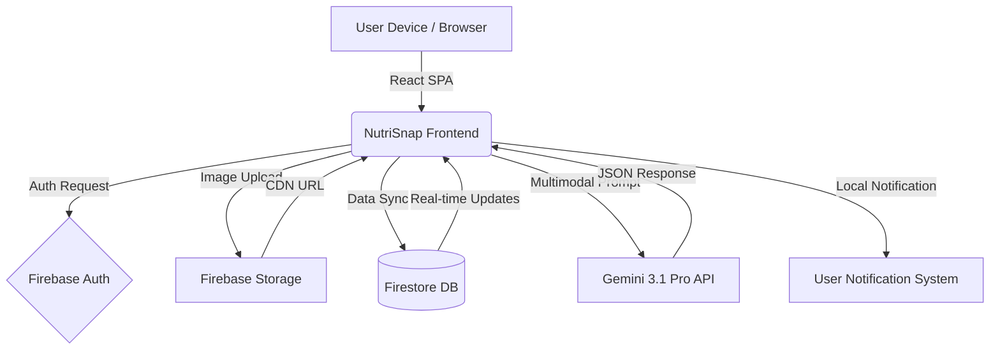

# NutriSnap AI - Intelligent Nutrition & Fitness Companion

NutriSnap is a production-grade health and fitness application designed to simplify the complex process of nutrition tracking. By leveraging cutting-edge Artificial Intelligence and a seamless mobile-first user experience, NutriSnap transforms a simple photo into a detailed nutritional breakdown and personalized coaching session.

## ✨ Key Features

### 📸 AI-Powered Food Recognition
Transform your meal photos into actionable data. Using **Gemini 3.1 Pro's multimodal capabilities**, NutriSnap identifies food items, estimates portion sizes, and calculates a full nutritional breakdown (Calories, Protein, Carbs, Fats) with high precision.
- **Multimodal Analysis**: Processes both image and text context.
- **Portion Estimation**: Intelligently guesses weight/volume to calculate macros.
- **Fallback Database**: Includes a local fallback for common items if the AI is unreachable.

### 🤖 Personalized AI Coach
More than just a tracker, NutriSnap includes a **conversational AI coach**. It analyzes your entire history, current goals, and daily progress to provide tailored advice, answer nutrition questions, and keep you motivated.
- **Context-Aware**: Knows your BMI, current calorie balance, and recent meals.
- **Proactive Suggestions**: Offers follow-up questions to deepen your understanding.
- **Motivational Tone**: Adapts its personality based on your progress and goals.

### 🧘 AI Body Analysis
Go beyond the scale. Upload a body scan image to receive an AI-driven estimate of your **Body Type** and **Body Fat Percentage**. This helps track physical composition changes that weight alone can't show.
- **Visual Progress**: Stores body scan history to visualize physical changes.
- **Privacy-First**: Images are stored securely in your private user folder.

### 💧 Smart Hydration Tracking
Stay hydrated with a visually stunning **live liquid wave animation**. The interface provides real-time feedback on your water intake goals with fluid, spring-physics-based transitions.
- **Interactive Waves**: The "water" level rises and ripples as you log intake.
- **Quick Log**: One-tap buttons for common amounts (250ml, 500ml).

### 📈 Advanced Analytics & Trends
Visualize your journey with interactive charts. Track your calorie trends and macronutrient distribution over time using **Recharts-powered dashboards**, helping you identify patterns and optimize your diet.
- **Weekly Trends**: Composed charts showing calories (line) and macros (bars) together.
- **Macro Breakdown**: Detailed tooltips showing grams and percentage of daily goals.

### 🎯 Customizable Nutritional Goals
Tailor the app to your specific needs. Set custom calorie limits and macronutrient ratios (Protein/Carbs/Fats) using **intuitive sliders**.
- **Dynamic Recalculation**: BMI and macro goals are updated instantly as you change your metrics.
- **Smart Defaults**: Provides recommended targets based on your weight and fitness objective.

### 🗓️ Comprehensive History Management
Access a detailed log of every meal and body scan. Filter your history by date or search for specific items to review your past choices and progress.
- **Skeleton Loading**: Smooth transitions while filtering large history sets.
- **Image Persistence**: Every log includes the original photo stored in the cloud.

### 🔐 Secure & Private
Your data is protected by **Firebase Authentication** and secured with strict Firestore rules. We support Google, GitHub, and Email/Password login methods.

---

## 🔑 APIs & Secrets

To run NutriSnap AI, you need to configure the following environment variables and configuration files:

### 1. Gemini API (`GEMINI_API_KEY`)
- **Provider**: Google AI Studio
- **Usage**: Powers the `analyzeFoodImage`, `analyzeBodyImage`, and `getAICoachResponse` services.
- **Setup**: Obtain a key from [aistudio.google.com](https://aistudio.google.com/).

### 2. Firebase Configuration (`firebase-applet-config.json`)
- **Provider**: Google Firebase
- **Usage**: Used for Authentication, Firestore (Database), and Cloud Storage.
- **Required Services**:
  - **Authentication**: Enable Google, GitHub, and Email/Password providers.
  - **Firestore**: Create a database in "Native Mode".
  - **Storage**: Enable a storage bucket for user uploads.

### 3. GitHub OAuth (`GITHUB_CLIENT_ID`, `GITHUB_CLIENT_SECRET`)
- **Provider**: GitHub Developer Settings
- **Usage**: Enables "Sign in with GitHub" functionality.
- **Setup**: Create a new OAuth App on GitHub and set the callback URL to your app's domain.

### 4. Google OAuth
- **Provider**: Google Cloud Console
- **Usage**: Enables "Sign in with Google" functionality.
- **Setup**: Usually handled automatically by Firebase Auth once enabled in the Firebase Console.

---

## 🏗 System Architecture

The application follows a modern, serverless full-stack architecture optimized for low latency and high scalability.

- **Frontend**: React 18 Single Page Application (SPA) built with Vite and TypeScript.
- **Styling**: Tailwind CSS 4.0 for utility-first design, following a premium iOS aesthetic with glassmorphism and fluid animations.
- **State Management**: React Context API (`UserContext`) for global state, including user profile, real-time scan history, and daily nutritional summaries.
- **Backend-as-a-Service**: Firebase (Firestore for real-time data, Auth for secure identity, Storage for high-res images).
- **AI Engine**: Google Gemini 3.1 Pro and Flash models for multimodal image analysis and conversational coaching.
- **Haptics & Notifications**: Custom integration for tactile feedback and local reminders.

## 📊 Block Diagram



## 🧩 Problem & Solution

**The Problem**: Traditional calorie counting is tedious. Users must manually search for ingredients, estimate portions, and log data into complex spreadsheets. This friction leads to low adherence and abandoned health goals. Most apps lack personalized context, treating every user with generic advice.

**The Solution**: NutriSnap removes the friction through AI-first design.
1. **Instant Analysis**: A single photo identifies food, estimates portions, and calculates macros using Gemini's advanced vision capabilities.
2. **Body Metrics**: AI-driven body type and fat percentage estimation from images, providing a more holistic view of health than just weight.
3. **Conversational Coaching**: A personalized AI coach that understands your specific goals, history, and current progress, offering actionable insights rather than just data.
4. **Frictionless Logging**: Multiple entry points (Scan, Search, Manual) ensure that logging a meal never takes more than a few seconds.

## 🔄 Detailed Workflow

1. **Onboarding & Profile Setup**: Users set their physical metrics (height, weight) and fitness goals (lose, gain, maintain). The app automatically calculates base calorie limits and macro targets based on these inputs.
2. **Meal Logging**:
   - **Scan**: User captures or uploads a food image. Gemini 3.1 Pro analyzes the image, returning a structured JSON with food name, calories, protein, carbs, and fats.
   - **Search**: Users can search a predefined database for common foods.
   - **Manual**: Direct input for homemade meals or specific nutritional labels.
3. **Data Persistence**: All logs are automatically synced to Firestore and aggregated into daily nutritional summaries.
4. **AI Coaching**: The AI Coach analyzes the user's profile and recent scans. It provides context-aware advice, identifies trends, and suggests follow-up questions to help users understand their habits.
5. **Real-time Monitoring**: The Home screen visualizes progress against daily calorie and water goals using fluid animations and color-coded indicators.
6. **Settings & Customization**: Users can refine their macro percentages, set water goals, and manage meal/hydration reminders.

## 🛠 Tech Stack

- **Framework**: React 18 + Vite + TypeScript
- **AI**: @google/genai (Gemini 3.1 Pro / Flash)
- **Database**: Firebase Firestore (NoSQL)
- **Authentication**: Firebase Auth (Google Provider)
- **Storage**: Firebase Cloud Storage
- **Animations**: Framer Motion (motion/react) for layout transitions and liquid effects.
- **Icons**: Lucide React
- **Charts**: Recharts for historical data visualization.
- **Styling**: Tailwind CSS 4.0 with custom glassmorphism themes.

## 🚀 Getting Started

To run NutriSnap AI locally or in a development environment, follow these steps:

### Prerequisites
- **Node.js**: Version 18 or higher.
- **Firebase Project**: A Firebase project with Authentication (Google, GitHub, Email), Firestore, and Storage enabled.
- **Gemini API Key**: An API key from [Google AI Studio](https://aistudio.google.com/).

### Installation
1. **Clone the repository**:
   ```bash
   git clone <repository-url>
   cd nutrisnap-ai
   ```
2. **Install dependencies**:
   ```bash
   npm install
   ```
3. **Configure Environment Variables**:
   Copy `.env.example` to `.env` and fill in the required values:
   ```bash
   cp .env.example .env
   ```
   - `GEMINI_API_KEY`: Your Gemini API key.
   - `GITHUB_CLIENT_ID`: Your GitHub OAuth Client ID.
   - `GITHUB_CLIENT_SECRET`: Your GitHub OAuth Client Secret.

4. **Firebase Configuration**:
   Ensure `firebase-applet-config.json` contains your Firebase project credentials.

5. **Run the development server**:
   ```bash
   npm run dev
   ```
   The app will be available at `http://localhost:3000`.

## 📁 Project Structure

```text
├── src/
│   ├── components/       # Reusable UI components (Layout, Progress, etc.)
│   ├── contexts/         # React Contexts (UserContext for global state)
│   ├── lib/              # Utility libraries (Haptics, Notifications, Utils)
│   ├── screens/          # Main application screens (Home, Analytics, Chat, etc.)
│   ├── services/         # API and Storage services (Gemini, Firebase)
│   ├── types/            # TypeScript interfaces and types
│   ├── App.tsx           # Main application entry and Auth routing
│   ├── firebase.ts       # Firebase initialization
│   └── index.css         # Global styles and Tailwind imports
├── firebase-blueprint.json # Data schema definition
├── firestore.rules       # Security rules for Firestore
├── metadata.json         # App metadata and permissions
└── package.json          # Dependencies and scripts
```

## 🔑 APIs & Configuration

- **Gemini API**: Accessed via `process.env.GEMINI_API_KEY`. Used for `generateContent` (text/chat) and multimodal image analysis.
- **Firebase Config**: Loaded from `firebase-applet-config.json`.
- **Haptics**: Custom implementation for iOS-style tactile feedback on interactions.
- **Storage Service**: Centralized logic for Firestore CRUD operations and Storage uploads.

---
*NutriSnap AI - Precision Nutrition, Simplified.*
