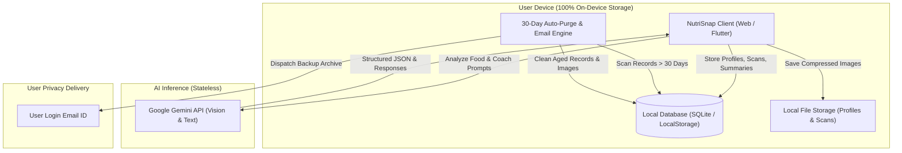

# NutriSnap AI - Privacy-First Nutrition & Fitness Companion

NutriSnap AI is an intelligent, privacy-first nutrition and fitness tracking application powered by Google Gemini AI. It transforms food photos into detailed nutritional breakdowns, tracks body composition, and provides real-time personalized health coaching—while keeping **100% of user data securely on-device with zero external cloud database tracking**.

---

## 🎯 Project Overview & Privacy Philosophy

Unlike traditional fitness apps that upload sensitive meals, body scans, and health records to remote servers, NutriSnap AI adheres to a strict **On-Device Data Privacy Model**:

- **Zero Cloud Database Tracking**: No remote Firestore or cloud databases hold your nutritional logs, scans, or chats.
- **On-Device Storage Engine**: All meals, body scans, hydration logs, and AI conversations reside locally (SQLite database and local app directories on mobile; secure client storage with image compression on web).
- **Automated 30-Day Auto-Purge & Email Backup**:
  - Automatically evaluates stored logs on app startup and user login.
  - Prior to cleaning records older than 30 days, the engine compiles a complete, structured health record archive and dispatches it directly to the user's login email ID.
  - Once verified, aged database records and orphaned images are safely purged from local storage, preserving device memory without data loss.
- **Private Data Export & Restore**: Users can export full backups of their health records as encrypted/portable JSON files and restore them at any time.

---

## ✨ Key Features

### 📸 AI-Powered Food Recognition (Multimodal Gemini Vision)
Capture or upload a photo of any meal or snack:
- **Instant Macro Breakdown**: Calculates calories, protein, carbohydrates, and fats in real-time.
- **Portion & Weight Estimation**: Accurately estimates portion sizes and ingredients using Gemini multimodal reasoning.
- **Confidence & Detailed Descriptions**: Highlights detected foods and notes dietary balance.
- **Offline & Fallback Database**: Built-in nutritional database for common items when offline.

### 🤖 Personalized AI Health & Nutrition Coach
An interactive, context-aware conversational AI coach:
- **Holistic Context Awareness**: Factors in your BMI, weight targets, calorie limits, today's macro intake, and recent meal scans.
- **Proactive & Actionable**: Suggests follow-up questions, meal adjustments, and healthier alternatives.
- **Hostel & Budget Modes**: Tailored advice for college students and users managing specific grocery budgets.

### 🧘 AI Body Composition & Visual Progress
Track physical composition beyond just numbers on a scale:
- **AI Body Scan Estimation**: Evaluates body type (Ectomorph, Mesomorph, Endomorph), body fat percentage, and muscle mass index.
- **On-Device Image Storage**: Body scan photos are compressed and kept exclusively in local app storage.

### 💧 Smart Hydration Tracking
Monitor water intake with an interactive live liquid wave animation:
- **Spring-Physics Wave**: Responsive wave level dynamically adjusts as you log intake.
- **Quick-Log Shortcuts**: One-tap increments (250ml, 500ml) and customizable daily hydration targets.

### 📈 Advanced Analytics & Historical Trends
Comprehensive data visualization for long-term health tracking:
- **Weekly & Monthly Trends**: Composed charts showing calorie intake lines alongside macro distribution bars.
- **Goal Adherence**: Visual progress bars and breakdown tooltips comparing intake against personalized macro goals.
- **Meal History**: Filterable, searchable timeline with instant deletion and meal detail views.

### 🎯 Dynamic Nutritional Goal Calculator
Customizable calorie limits and macronutrient distribution:
- **Interactive Ratio Sliders**: Seamlessly balance protein, carbs, and fats percentages.
- **Dynamic Recalculation**: Basal metabolic rate (BMR) and recommended daily allowances update dynamically based on age, gender, height, weight, and activity level.

---

## 🏗 System Architecture

NutriSnap AI is built as a dual-platform ecosystem featuring both a modern Web application and a native Flutter mobile application.


```mermaid
graph TD
    subgraph "User Device (100% On-Device Storage)"
        ClientApp["NutriSnap Client (Web / Flutter)"]
        LocalDB[("Local Database (SQLite / LocalStorage)")]
        LocalFiles["Local File Storage (Profiles & Scans)"]
        PurgeEngine["30-Day Auto-Purge & Email Engine"]
    end

    subgraph "AI Inference (Stateless)"
        GeminiAPI["Google Gemini API (Vision & Text)"]
    end

    subgraph "User Privacy Delivery"
        UserEmail["User Login Email ID"]
    end

    ClientApp -->|Store Profiles, Scans, Summaries| LocalDB
    ClientApp -->|Save Compressed Images| LocalFiles
    ClientApp -->|Analyze Food & Coach Prompts| GeminiAPI
    GeminiAPI -->|Structured JSON & Responses| ClientApp
    PurgeEngine -->|Scan Records > 30 Days| LocalDB
    PurgeEngine -->|Dispatch Backup Archive| UserEmail
    PurgeEngine -->|Clean Aged Records & Images| LocalDB
```

---

## 🛠 Tech Stack

### Web Application
- **Framework**: React 19, Vite, TypeScript
- **Styling**: Tailwind CSS 4 with custom glassmorphism and dark/light theme support
- **Animations**: Framer Motion (`motion/react`) for layout transitions and fluid liquid animations
- **Charts & Graphs**: Recharts (`ComposedChart`, `Bar`, `Line`, `ResponsiveContainer`)
- **Icons**: Lucide React
- **Storage**: Client-side IndexedDB & localStorage with canvas-based image compression
- **PDF & Export**: jsPDF and jsPDF-AutoTable for nutrition report generation

### Flutter Mobile Application (`flutter_app/`)
- **Framework**: Flutter 3 (Dart SDK >= 3.0.0)
- **State Management**: Flutter Riverpod (`flutter_riverpod: ^2.4.9`)
- **Routing**: GoRouter (`go_router: ^13.1.0`)
- **Charts**: fl_chart (`fl_chart: ^0.65.0`)
- **Icons**: Lucide Icons (`lucide_icons: ^0.2.0`)
- **Animations**: Flutter Animate (`flutter_animate: ^4.2.0+1`)
- **Local Database**: On-device SQLite architecture (`nutrisnap_ai.db`) with tables for `profiles`, `scans`, `daily_summaries`, `chat_messages`, and `purge_audit_logs`
- **Local File Management**: `LocalFileService` saving images to application document sandbox
- **AI Integration**: `google_generative_ai: ^0.2.0` (Gemini Pro / Flash)

---

## 📁 Repository Structure

```text
├── src/                                  # Web Application Source (React 19 + TypeScript)
│   ├── components/                       # Shared UI components (Layout, Wave, Charts)
│   ├── contexts/                         # React Contexts (UserContext, Auth, Storage)
│   ├── lib/                              # Utilities, haptics, and notification helpers
│   ├── screens/                          # Main screens (Home, Analytics, Scan, Chat, Settings)
│   ├── services/                         # Gemini AI & on-device storage services
│   ├── types/                            # TypeScript data interfaces and models
│   ├── App.tsx                           # Main app entry and navigation
│   └── main.tsx                          # React DOM entry point
│
├── flutter_app/                          # Native Mobile Application (Flutter 3 + Riverpod)
│   ├── lib/
│   │   ├── core/
│   │   │   ├── db/                       # On-device SQLite database engine (local_database.dart)
│   │   │   ├── services/                 # LocalFileService, StorageService, GeminiService
│   │   │   ├── utils/                    # DataPurgeManager (30-day purge & email backup)
│   │   │   ├── models/                   # UserProfile, ScanResult, DailySummary, ChatMessage
│   │   │   └── theme/                    # AppTheme, Colors, Typography
│   │   ├── features/
│   │   │   ├── auth/                     # Local User State & Riverpod Providers
│   │   │   ├── home/                     # Home Dashboard, Hydration Wave, Today's Macros
│   │   │   ├── scan/                     # Food Camera, Image Picker & Gemini Analyzer
│   │   │   ├── chat/                     # AI Coach Chat Screen
│   │   │   ├── analytics/                # Macro & Calorie Charts (fl_chart)
│   │   │   └── settings/                 # Profile, Target Sliders, Data Export & Backup
│   │   └── main.dart                     # Flutter App entry point
│   └── pubspec.yaml                      # Flutter dependencies and configuration
│
├── metadata.json                         # Platform application metadata and permissions
├── package.json                          # Web dependencies and npm scripts
└── README.md                             # Project documentation
```

---

## 🚀 Getting Started

### Prerequisites
- **Node.js**: v18.0.0 or higher
- **Gemini API Key**: Obtain a key from [Google AI Studio](https://aistudio.google.com/)
- *(Optional for Mobile)*: Flutter SDK 3.x and Android Studio / Xcode

---

### Running the Web Application

1. **Clone the repository**:
   ```bash
   git clone <repository-url>
   cd nutrisnap-ai
   ```

2. **Install dependencies**:
   ```bash
   npm install
   ```

3. **Configure Environment Variables**:
   Create a `.env` file from `.env.example`:
   ```bash
   cp .env.example .env
   ```
   Add your Gemini API key:
   ```env
   GEMINI_API_KEY=your_gemini_api_key_here
   ```

4. **Start the development server**:
   ```bash
   npm run dev
   ```
   Open [http://localhost:3000](http://localhost:3000) in your browser.

5. **Build for production**:
   ```bash
   npm run build
   ```

---

### Running the Flutter Mobile Application

1. **Navigate to the Flutter directory**:
   ```bash
   cd flutter_app
   ```

2. **Install Flutter dependencies**:
   ```bash
   flutter pub get
   ```

3. **Run on an emulator or connected device**:
   ```bash
   flutter run
   ```

---

## 🔒 Data Retention & Email Archive Workflow

NutriSnap AI includes an automatic data life-cycle management policy to maintain high performance while ensuring user records are preserved:

1. **Startup / Login Inspection**: When the app starts or a user logs in, the `DataPurgeManager` inspects local database entries.
2. **Pre-Purge Archive Generation**: All food scans, daily summaries, chat logs, and profile metrics older than 30 days are bundled into a JSON backup archive.
3. **User Email Delivery**: The compiled archive is dispatched to the user's login email ID.
4. **Local Purge Execution**:
   - Outdated records are purged from the SQLite `scans`, `daily_summaries`, and `chat_messages` tables.
   - Corresponding image files are removed from the local filesystem cache.
   - An audit record is logged in the `purge_audit_logs` table.

---

## 📄 License

This project is licensed under the MIT License - see the LICENSE file for details.

*NutriSnap AI - Precision Nutrition, 100% Private.*
